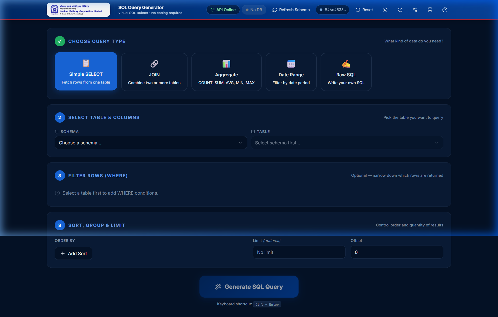
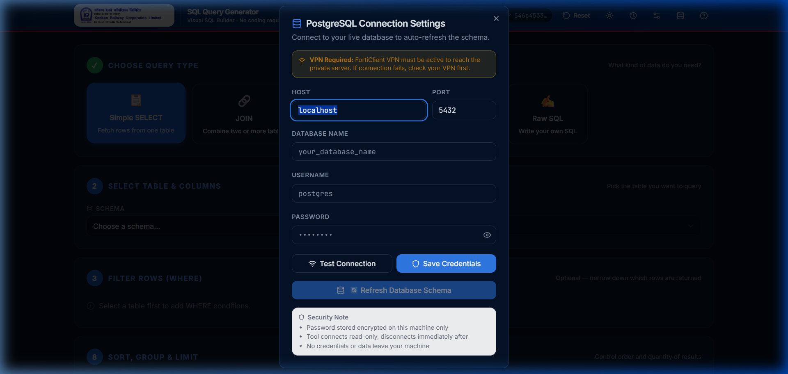

# 🚂 SQL Query Generator Engine

> **Visual SQL query builder for Kokan Railway Corporation's PostgreSQL databases.**
> A visual SQL query builder that enables users to generate complex SQL queries through an intuitive interface without manually writing SQL code.

---

## ✨ Features

- Visual Query Builder
- Multiple Query Types (SELECT, JOIN, Aggregate, UNION, Date Range)
- Real-time Query Validation
- SQL Preview and Download
- Query History
- Dark/Light Theme
- Offline Query Generation
- PostgreSQL Schema Support
- Standalone Windows Executable

  
---

  ## 📸 Screenshots

### 🖥️ Interactive Visual Query Builder


### ⚙️ Database Connection Settings


---

## 🛠️ Tech Stack

### Backend
- Python
- FastAPI
- SQLite
- Pandas

### Frontend
- React
- TypeScript
- Vite
- Tailwind CSS

## 🚀 Getting Started

### Backend

```bash
pip install -r requirements-api.txt
python api.py
```

### Frontend

```bash
cd frontend
npm install
npm run dev
```

Open: `http://localhost:5173`

## 📁 Project Structure

```text
sql-query-generator/
├── api.py
├── query_engine.py
├── db_files/
├── frontend/
├── dist/
└── README.md
```

## 📌 Key Functionalities

- Generate SQL queries visually
- Browse schemas and tables
- Create JOIN, GROUP BY, ORDER BY, and UNION queries
- Validate queries before execution
- Connect to PostgreSQL databases
- Export generated SQL

## 📦 Executable Version

The project can be packaged as a standalone Windows executable using PyInstaller:

```bash
python package_app.py
```

## 👩‍💻 Author

**Tejashri Devrukhkar**

B.Tech Artificial Intelligence & Data Science

## 📄 License

For educational and organizational use.Built for Konkan Railway Corporation Limited.

---

<p align="center">
  Built with ❤️ for Kokan Railway Corporation
</p>
